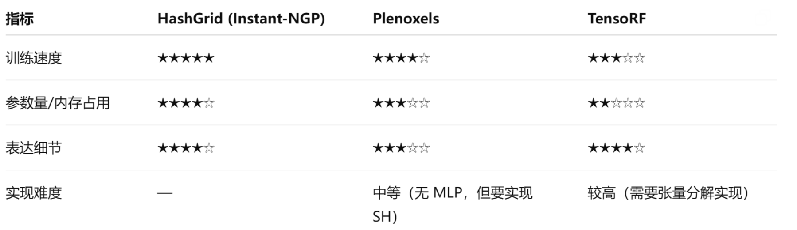
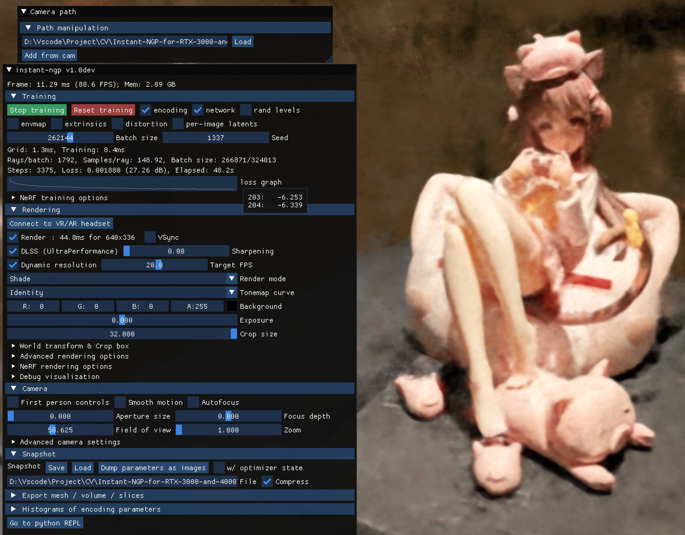
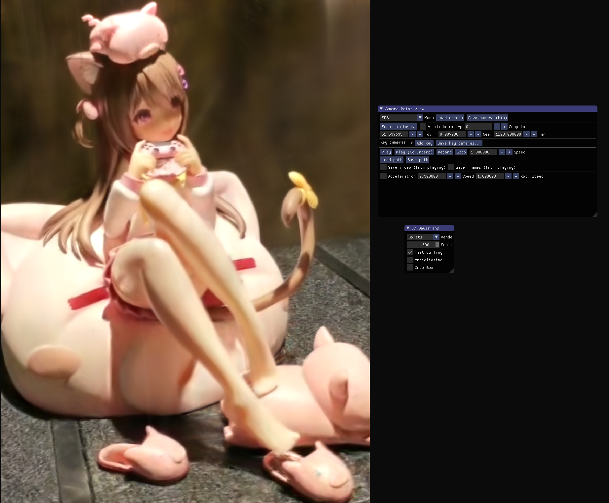

# 实验报告

**定量评估代码**：

**原视频、模型、渲染视频**：https://pan.baidu.com/s/1yjvy7kyEYe4KzAKCNO3LKQ?pwd=dhnb

# 准备工作

1. 数据：使用 8K 录像功能录制手办的环绕视频 input.mp4

   

2. 环境：

   colmap 3.9.1

   ffmpeg：最新的 git master 分支构建版本：2025-06-23-git-e6298e0759

# Task 1

## 选择 NeRF 加速技术

**instant-ngp**：高速神经辐射场实现

比较三种加速技术的效果（如图所示），我们选用训练速度最快的 instant-ngp：https://github.com/NVlabs/instant-ngp 



### 项目概述

**Instant-NGP** 是 NVIDIA 实验室开发的一个革命性的神经图形基元实现，主要特点是能够在极短时间内训练高质量的 NeRF 模型。 该项目实现了四种神经图形基元：神经辐射场（NeRF）、有符号距离函数（SDF）、神经图像和神经体积。

### 与原版 NeRF 的核心差异

1. **训练速度革命性提升**

- **Instant-NGP**：可以在 5 秒内训练一个狐狸场景的 NeRF 模型，其他场景的 NeRF 一般也能在 20s 左右看到收敛效果。 
- **原版 NeRF**：需要几小时到一两天的训练时间，取决于分辨率

2. **技术架构差异**

- **Instant-NGP**：使用多分辨率哈希编码（Multiresolution Hash Encoding）结合 tiny-cuda-nn 框架 
- **原版 NeRF**：使用简单的全连接网络，权重约 5MB，直接从空间位置和视角方向映射到颜色和不透明度 

3. **渲染性能**

- **Instant-NGP**：渲染速度极快，支持实时交互
- **原版 NeRF**：渲染一张图像需要几秒到 30 秒不等，取决于分辨率 

4. **用户体验**

- **Instant-NGP**：提供完整的交互式 GUI，包括：
  - 实时探索神经图形基元的综合控制
  - VR 模式支持
  - 快照保存和加载功能
  - 相机路径编辑器
  - NeRF 到网格和 SDF 到网格的转换
  - 相机姿态和镜头优化 
- **原版 NeRF**：主要通过命令行操作，使用 Tensorboard 监控训练过程 

5. **硬件要求和部署**

- **Instant-NGP**：针对不同 NVIDIA GPU 系列提供预编译版本，支持 RTX 5000、RTX 3000/4000、RTX 2000 和 GTX 1000 系列 
- **原版 NeRF**：基于 TensorFlow 1.15，需要手动配置环境 

6. **应用场景扩展**

- **Instant-NGP**：不仅支持 NeRF，还支持 SDF、神经图像和神经体积等多种神经图形基元
- **原版 NeRF**：专注于神经辐射场的实现

### 技术创新点

Instant-NGP 的核心创新在于**多分辨率哈希编码**技术，这使得：
1. 训练速度提升了几个数量级
2. 内存使用更加高效
3. 支持更高分辨率的实时渲染

### 实际应用优势

Instant-NGP 提供了完整的工作流程，包括：
- 数据预处理脚本（COLMAP 集成）
- 评估工具和指标计算
- 丰富的配置选项
- 多种输出格式支持

这使得 Instant-NGP 不仅在学术研究中有价值，在实际应用中也更加实用和高效。
        

## 实验过程

1. 将 instant-ngp 的 Github 仓库克隆到本地

2. 将下载好的 colmap 和 ffmpeg 工具打包为 external 文件夹放置于项目中

3. 将拍摄好的视频 input.mp4 放置于 scripts 文件夹中，调整 colmap2nerf.py 的参数设置正确的路径，运行 colmap2nerf.py 即可调用 ffmpeg 将视频帧截取为图片存储在 images 文件夹中，并调用 colmap 估计相机参数，保存为 [transforms.json](Task 1/transforms.json)

4. 运行 instant-ngp.exe，将 images 文件夹和 [transforms.json](Task 1/transforms.json) 拖动到界面中即可开始训练，并且可以看到训练的 loss 曲线：

   

5. 点击 stop training 可以停止训练，点击 save 可以保存 ingp 模型，在 render 菜单中设置好参数即可渲染视频。

6. 将[Task 1](Task 1)中的评估代码放置于 scripts 文件夹中，运行 split_test_set.py 划分测试集，运行 calculate_metrics.py 进行定量评价，评价结果为[evaluation_results.json](Task 1/evaluation_results.json)。

## 实验设置

### 1. 训练测试集划分

数据集划分策略

- **测试集比例**：默认 20% (`test_ratio=0.2`)
- **随机种子**：42，确保结果可重现
- **划分方式**：随机打乱后按比例划分
- **输出文件**：
  - `transforms_train.json`：训练集
  - `transforms_test.json`：测试集

```python
# 划分示例
n_total = len(frames)
n_test = max(1, int(n_total * test_ratio))  # 至少1张测试图像
n_train = n_total - n_test
```

### 2. 网络结构

主网络架构

#### 位置编码网络
```json
"encoding": {
    "otype": "HashGrid",           // 哈希网格编码
    "n_levels": 8,                 // 8个分辨率层级
    "n_features_per_level": 4,     // 每层4个特征
    "log2_hashmap_size": 19,       // 哈希表大小 2^19
    "base_resolution": 16          // 基础分辨率
}
```

#### 主MLP网络
```json
"network": {
    "otype": "FullyFusedMLP",      // 全融合MLP
    "activation": "ReLU",          // ReLU激活函数
    "output_activation": "None",   // 输出层无激活
    "n_neurons": 64,               // 64个神经元
    "n_hidden_layers": 1           // 1个隐藏层
}
```

#### 方向编码网络
```json
"dir_encoding": {
    "otype": "Composite",
    "nested": [
        {
            "n_dims_to_encode": 3,
            "otype": "SphericalHarmonics",  // 球谐函数编码
            "degree": 4                     // 4阶球谐
        }
    ]
}
```

#### RGB输出网络
```json
"rgb_network": {
    "otype": "FullyFusedMLP",
    "activation": "ReLU",
    "n_neurons": 64,
    "n_hidden_layers": 2           // 2个隐藏层
}
```

#### 网络变体配置
- **标准配置**：`base.json`
- **大型配置**：`big.json` - 增大哈希表到 `2^21`
- **其他变体**：`small.json`, `densegrid.json` 等

### 3. Batch Size

Instant-NGP 采用**光线采样**而非传统的图像批处理：
- **光线批大小**：通常为 2^16 到 2^20 条光线
- **动态调整**：根据GPU内存自动调整
- **采样策略**：随机从训练图像中采样光线

### 4. Learning Rate（学习率）

#### 主网络学习率
```json
"optimizer": {
    "otype": "Adam",
    "learning_rate": 1e-2,         // 初始学习率 0.01
    "beta1": 0.9,
    "beta2": 0.99,
    "epsilon": 1e-15,
    "l2_reg": 1e-6                 // L2正则化
}
```

#### 学习率衰减策略
```json
"optimizer": {
    "otype": "ExponentialDecay",
    "decay_start": 20000,          // 20k步后开始衰减
    "decay_interval": 10000,       // 每10k步衰减一次
    "decay_base": 0.33             // 衰减因子
}
```

#### 其他组件学习率
- **畸变图学习率**：`1e-4`
- **环境贴图学习率**：`1e-2`

### 5. 优化器

#### 主优化器配置
```json
"optimizer": {
    "otype": "Ema",               // 指数移动平均
    "decay": 0.95,               // EMA衰减率
    "nested": {
        "otype": "ExponentialDecay", // 嵌套指数衰减
        "nested": {
            "otype": "Adam"          // 最终使用Adam优化器
        }
    }
}
```

#### Adam优化器参数
- **beta1**: 0.9（一阶矩估计的衰减率）
- **beta2**: 0.99（二阶矩估计的衰减率）
- **epsilon**: 1e-15（数值稳定性参数）

### 6. Iteration 和 Epoch

#### 训练迭代
- **总迭代次数**：通常 35,000 步（约2分钟）
- **无传统Epoch概念**：采用连续光线采样
- **检查点保存**：每1000步保存一次

#### 关键训练阶段
- **0-20k步**：全学习率训练
- **20k-30k步**：学习率开始衰减
- **30k+步**：精细调优

### 7. Loss Function（损失函数）

#### 主损失函数
```json
"loss": {
    "otype": "Huber"              // Huber损失（L1+L2混合）
}
```

#### 其他损失组件
- **环境贴图损失**：`RelativeL2`
- **正则化损失**：L2权重衰减
- **畸变损失**：减少几何畸变

#### Huber损失特点
- 结合L1和L2损失优点
- 对异常值更鲁棒
- 收敛更稳定

### 8. 评价指标

#### 图像质量指标
```json
{
    "mean_psnr": 10.23,           // 峰值信噪比
    "mean_ssim": 0.209,           // 结构相似性
    "mean_lpips": 0.742,          // 感知相似性
    "mean_mse": 6202.28,          // 均方误差
    "mean_mae": 63.37             // 平均绝对误差
}
```

#### 指标说明
1. **PSNR**：峰值信噪比，越高越好（>20dB为良好）
2. **SSIM**：结构相似性指数，范围[0,1]，越高越好
3. **LPIPS**：学习感知图像块相似性，越低越好
4. **MSE/MAE**：像素级误差，越低越好

#### 统计信息
每个指标都包含：
- 均值（mean）
- 标准差（std）
- 最小值（min）
- 最大值（max）

### 9. 训练配置总结

#### 关键特点
1. **快速训练**：2-5分钟完成训练
2. **多分辨率哈希编码**：核心创新技术
3. **自适应学习率**：指数衰减+EMA
4. **鲁棒损失函数**：Huber损失
5. **全面评估**：多维度图像质量指标

#### 与传统NeRF对比
- **训练时间**：从数小时缩短到数分钟
- **网络结构**：更小更高效的MLP
- **编码方式**：哈希网格 vs 位置编码
- **优化策略**：更激进的学习率和衰减

这种配置使得 Instant-NGP 能够在保持高质量的同时实现极快的训练速度，是NeRF技术的重大突破。


## 定量评价         

### 1. 测试集划分过程

#### 1.1 划分策略
- **划分比例**: 默认测试集占总数据的 20% (`test_ratio=0.2`)
- **随机种子**: 使用固定种子 42 确保结果可重复
- **划分方法**: 随机打乱所有图像帧后按比例分配

#### 1.2 具体实现流程
```python
def split_dataset(self, seed: int = 42) -> Tuple[List[Dict], List[Dict]]:
    """划分训练集和测试集"""
    transforms = self.load_transforms()
    frames = transforms['frames']
    
    # 设置随机种子确保可重复性
    random.seed(seed)
    np.random.seed(seed)
    
    # 随机打乱并划分
    random.shuffle(frames)
    n_test = max(1, int(len(frames) * self.test_ratio))
    
    test_frames = frames[:n_test]
    train_frames = frames[n_test:]
```

#### 1.3 输出文件
- **训练集配置**: `transforms_train.json`
- **测试集配置**: `transforms_test.json`
- 保持原始 `transforms.json` 的相机参数和其他配置不变

### 2. 定量评价流程

#### 2.1 完整评价流程
评价过程分为三个主要步骤：

1. **数据集划分**: 从原始数据中分离出测试集
2. **图像渲染**: 使用训练好的模型渲染测试视角
3. **指标计算**: 比较渲染图像与真实图像

#### 2.2 图像渲染
使用 instant-ngp.exe 进行测试图像渲染：
```bash
instant-ngp.exe transforms_test.json \
  --load_snapshot model.ingp \
  --screenshot_transforms transforms_test.json \
  --screenshot_dir test_renders \
  --width 720 --height 1280
```

也可以手动在 instant-ngp.exe 中选择相应的相机位点保存渲染图片

### 3. 评价指标详解

#### 3.1 主要指标

**1. PSNR (Peak Signal-to-Noise Ratio)**
- **计算方式**: 基于均方误差的对数变换
- **数值范围**: 通常 20-40 dB，越高越好
- **物理意义**: 衡量图像重建的信噪比

**2. SSIM (Structural Similarity Index)**
- **计算方式**: 考虑亮度、对比度和结构的综合指标
- **数值范围**: 0-1，越接近 1 越好
- **物理意义**: 更符合人眼视觉感知的相似性度量

**3. LPIPS (Learned Perceptual Image Patch Similarity)**
- **计算方式**: 基于 AlexNet 特征的感知距离
- **数值范围**: 0-1，越小越好
- **物理意义**: 基于深度学习的感知相似性

**4. MSE (Mean Squared Error)**
- **计算方式**: 像素级均方误差
- **数值范围**: 0-∞，越小越好
- **物理意义**: 像素级重建精度

**5. MAE (Mean Absolute Error)**
- **计算方式**: 像素级平均绝对误差
- **数值范围**: 0-255，越小越好
- **物理意义**: 像素级平均偏差

#### 3.2 指标计算实现

```python
def calculate_metrics(self, gt_img, render_img):
    # 确保图像尺寸一致
    if gt_img.shape != render_img.shape:
        render_img = cv2.resize(render_img, (gt_img.shape[1], gt_img.shape[0]))
    
    # 计算各项指标
    psnr_val = psnr(gt_img, render_img, data_range=255)
    ssim_val = ssim(gt_img, render_img, multichannel=True, channel_axis=2, data_range=255)
    lpips_val = self.lpips_fn(gt_tensor, render_tensor).item()
    mse_val = np.mean((gt_img.astype(float) - render_img.astype(float)) ** 2)
    mae_val = np.mean(np.abs(gt_img.astype(float) - render_img.astype(float)))
```

### 4. 评价结果统计

#### 4.1 统计指标
对每个评价指标计算：
- **平均值** (`mean_*`): 所有测试图像的平均表现
- **标准差** (`std_*`): 表现的稳定性
- **最小值** (`min_*`): 最差表现
- **最大值** (`max_*`): 最佳表现

#### 4.2 实际评价结果示例
```json
{
  "mean_psnr": 10.23,     // 平均PSNR较低，说明重建质量有待提升
  "mean_ssim": 0.209,     // SSIM偏低，结构相似性不够好
  "mean_lpips": 0.742,    // LPIPS较高，感知差异明显
  "num_images": 12        // 测试了12张图像
}
```

### 5. 评价过程的技术细节

#### 5.1 图像预处理
- **格式转换**: BGR → RGB
- **尺寸对齐**: 确保真实图像和渲染图像尺寸一致
- **数据类型**: 统一为 float 类型进行计算

#### 5.2 LPIPS 计算细节
```python
# 归一化到[-1, 1]范围
img_tensor = torch.from_numpy(img).permute(2, 0, 1).float() / 127.5 - 1.0
# GPU加速
if torch.cuda.is_available():
    img_tensor = img_tensor.cuda()
# 计算感知距离
lpips_score = self.lpips_fn(img1_tensor, img2_tensor)
```

#### 5.3 错误处理
- **文件缺失**: 自动跳过找不到的渲染图像
- **尺寸不匹配**: 自动调整图像尺寸
- **计算异常**: 记录错误并继续处理其他图像

### 6. 使用方法

#### 6.1 完整评价流程
```bash
python evaluate_nerf.py --data_dir . --model_path model.ingp --test_ratio 0.2
```

#### 6.2 仅计算指标（跳过渲染）
```bash
python calculate_metrics.py --transforms transforms_test.json --render_dir test_renders
```

#### 6.3 自定义测试集划分
```bash
python split_test_set.py --transforms transforms.json --test_ratio 0.2 --seed 123
```

### 7. 结果分析

评估结果保存在：[evaluation_results.json](Task 1/evaluation_results.json)

#### 评估概况
- **测试图像数量**: 12 张
- **评估指标**: PSNR、SSIM、LPIPS、MSE、MAE
- **数据来源**: 从训练数据中随机划分的测试集

#### 详细指标分析

##### 1. PSNR (Peak Signal-to-Noise Ratio)
```
平均值: 10.23 dB (±0.43)
范围: 9.57 - 10.91 dB
```
**分析**: 

- PSNR 值偏低，通常高质量重建应达到 25-35 dB
- 标准差较小 (0.43)，说明不同视角的重建质量相对稳定
- **问题**: 重建图像与真实图像存在较大的像素级差异

##### 2. SSIM (Structural Similarity Index)
```
平均值: 0.2089 (±0.0283)
范围: 0.169 - 0.256
```
**分析**:
- SSIM 值很低，理想值应接近 1.0，通常好的重建应 > 0.8
- 说明重建图像在结构相似性方面表现不佳
- **问题**: 图像的亮度、对比度和结构信息丢失严重

##### 3. LPIPS (Learned Perceptual Image Patch Similarity)
```
平均值: 0.7417 (±0.0331)
范围: 0.681 - 0.785
```
**分析**:
- LPIPS 值较高，理想值应接近 0
- 基于深度学习的感知距离表明重建图像与真实图像在感知上差异明显
- **问题**: 从人眼感知角度，重建质量不理想

##### 4. MSE (Mean Squared Error)
```
平均值: 6202.28 (±612.12)
范围: 5277.29 - 7181.60
```
**分析**:
- MSE 值很高，说明像素级误差较大
- 标准差相对较大，不同视角的重建误差有一定波动

##### 5. MAE (Mean Absolute Error)
```
平均值: 63.37 (±3.42)
范围: 56.07 - 70.63
```
**分析**:
- 在 0-255 像素值范围内，平均绝对误差约为 63
- 相对稳定的标准差表明误差分布较为一致

#### 问题诊断

##### 可能的原因：
1. **训练不充分**: 模型可能需要更多训练迭代
2. **数据质量**: 输入图像质量或相机标定精度问题
3. **网络配置**: HashGrid 参数或网络结构可能需要调整
4. **场景复杂度**: 测试场景可能超出模型能力范围

##### 对比标准：
- **优秀 NeRF 结果**: PSNR > 25 dB, SSIM > 0.8, LPIPS < 0.2
- **当前结果**: 明显低于标准，需要改进

####  改进方向

##### 1. 训练方面
- 增加训练迭代次数（当前可能不足 35,000 步）
- 调整学习率衰减策略
- 检查损失函数收敛情况

##### 2. 数据方面
- 验证相机内外参标定精度
- 检查图像质量和光照一致性
- 确保训练视角覆盖充分

##### 3. 模型配置
- 尝试增大 HashGrid 的 `log2_hashmap_size`
- 调整网络层数和神经元数量
- 实验不同的编码分辨率设置

##### 4. 评估优化
- 增加测试集大小以获得更可靠的统计
- 分析单张图像的详细结果，识别特定问题
- 可视化对比渲染结果与真实图像

####  结论

当前的评估结果表明 Instant-NGP 模型在该数据集上的表现**需要显著改进**。所有关键指标都远低于高质量 NeRF 重建的标准。建议优先检查训练过程和数据质量，然后逐步优化模型配置参数。

通过系统性的改进，应该能够将 PSNR 提升到 25+ dB，SSIM 提升到 0.8+，LPIPS 降低到 0.2 以下，从而达到实用的重建质量。


# Task 2

使用其官方代码库训练 3D Gaussian，渲染效果截图如下：



## 实验过程

1. 将 [gaussian-splatting](https://github.com/graphdeco-inria/gaussian-splatting) 的 Github 仓库克隆到本地

2. 下载子项目[SIBR_viewers @ d8856f6](https://repo-sam.inria.fr/fungraph/3d-gaussian-splatting/binaries/viewers.zip)

3. 下载 submodules 中的子项目，[diff-gaussian-rasterization @ 9c5c202](https://github.com/graphdeco-inria/diff-gaussian-rasterization/tree/9c5c2028f6fbee2be239bc4c9421ff894fe4fbe0) 和 [simple-knn @ 86710c2]([KERBL Bernhard / simple-knn · GitLab](https://gitlab.inria.fr/bkerbl/simple-knn))

4. 下载 submodules/diff-gaussian-rasterization/third_party 中的子项目 [glm @ 5c46b9c](https://github.com/g-truc/glm/tree/5c46b9c07008ae65cb81ab79cd677ecc1934b903)

5. 安装 submoduals 中的子项目

   ```bash
   cd submoduals
   cd diff-gaussian-rasterization
   python setup.py install
   cd ../simple-knn
   python setup.py install
   cd ..
   cd ..
   ```

6. 视频截取帧，使用 Task 1 中截取的 images 文件夹中的图像，保存到 data/input 文件夹中，也可以运行以下代码重新截取：

   ```bash
   cd data
   ffmpeg -i input.mp4 -vf "setpts=0.2*PTS" input\input_%04d.jpg
   ```

   - `setpts=0.2*PTS` 将视频播放速度加快到原来的 5 倍。这意味着原视频的每秒帧数增加到 5 倍。
   - 如果原始视频是 30 FPS，加速后的视频将以 150 FPS 播放。
   - 尽管视频播放速度加快了，`ffmpeg` fps=1 会以每秒一帧的频率提取图片。

7. 产生点云

   ```bash
   python convert.py -s data
   ```

8. 开始训练

   ```bash
   python train.py -s data -m data/output
   ```

   训练好的模型会保存为 ply 文件。

9. 查看结果并在界面中点击渲染

   ```bash
   .\SIBR_viewers\bin\SIBR_gaussianViewer_app -m data/output
   ```

10. 将[Task 2](Task 2)中的评估代码放置于 项目文件夹中，运行 create_test_split.py 划分测试集，运行 evaluate_test_set.py 进行定量评价，评价结果为[test_evaluation_results.json](Task 2/test_evaluation_results.json)。

    ```bash
    python create_test_split.py data --test_ratio 0.1 --method random --seed 42
    python evaluate_test_set.py --model_path data/output --source_path data                      
    ```


## 实验设置


### 1. 训练测试集划分

#### 数据集类型支持
- **COLMAP数据集**：从 `sparse/0` 目录读取相机参数
- **Blender数据集**：从 `transforms_train.json` 文件读取

#### 划分策略
在 `scene\dataset_readers.py` 中实现：

```python
# LLFF数据集：每8张图片取1张作为测试集
if llffhold:
    test_cam_names_list = [name for idx, name in enumerate(cam_names) if idx % llffhold == 0]
# 自定义测试集：从test.txt文件读取
else:
    with open(os.path.join(path, "sparse/0", "test.txt"), 'r') as file:
        test_cam_names_list = [line.strip() for line in file]

# 划分训练和测试集
train_cam_infos = [c for c in cam_infos if train_test_exp or not c.is_test]
test_cam_infos = [c for c in cam_infos if c.is_test]
```

### 2. 网络结构

#### 核心组件
Gaussian Splatting 不是传统神经网络，而是基于3D高斯的显式表示：

```python
# 3D高斯参数（在gaussian_model.py中定义）
self._xyz = nn.Parameter()          # 3D位置
self._features_dc = nn.Parameter()  # 球谐函数DC分量（颜色）
self._features_rest = nn.Parameter() # 球谐函数其他分量
self._scaling = nn.Parameter()      # 缩放参数
self._rotation = nn.Parameter()     # 旋转参数（四元数）
self._opacity = nn.Parameter()      # 不透明度
self._exposure = nn.Parameter()     # 曝光参数
```

#### 激活函数
```python
self.scaling_activation = torch.exp                    # 缩放激活
self.opacity_activation = torch.sigmoid               # 不透明度激活
self.rotation_activation = torch.nn.functional.normalize # 旋转归一化
```

### 3. Batch Size

**特殊设计**：Gaussian Splatting 每次迭代只处理**一张图片**，没有传统意义的batch size概念。

```python
# 每次迭代随机选择一个视角
rand_idx = randint(0, len(viewpoint_stack)-1)
viewpoint_cam = viewpoint_stack.pop(rand_idx)
```

### 4. Learning Rate（学习率）

#### 分组学习率设置
在 `arguments\__init__.py` 中定义：

```python
class OptimizationParams:
    self.position_lr_init = 0.00016      # 位置学习率初始值
    self.position_lr_final = 0.0000016   # 位置学习率最终值
    self.feature_lr = 0.0025             # 特征学习率
    self.opacity_lr = 0.025              # 不透明度学习率
    self.scaling_lr = 0.005              # 缩放学习率
    self.rotation_lr = 0.001             # 旋转学习率
    self.exposure_lr_init = 0.01         # 曝光学习率初始值
```

#### 动态学习率调整
```python
# 位置参数使用指数衰减
position_lr = get_expon_lr_func(lr_init, lr_final, max_steps)
# 每次迭代更新学习率
gaussians.update_learning_rate(iteration)
```

### 5. 优化器

#### 优化器类型
```python
# 默认Adam优化器
if self.optimizer_type == "default":
    self.optimizer = torch.optim.Adam(l, lr=0.0, eps=1e-15)
# 稀疏Adam优化器（需要特殊版本）
elif self.optimizer_type == "sparse_adam":
    self.optimizer = SparseGaussianAdam(l, lr=0.0, eps=1e-15)
```

#### 参数分组
```python
l = [
    {'params': [self._xyz], 'lr': position_lr_init * spatial_lr_scale, "name": "xyz"},
    {'params': [self._features_dc], 'lr': feature_lr, "name": "f_dc"},
    {'params': [self._features_rest], 'lr': feature_lr / 20.0, "name": "f_rest"},
    {'params': [self._opacity], 'lr': opacity_lr, "name": "opacity"},
    {'params': [self._scaling], 'lr': scaling_lr, "name": "scaling"},
    {'params': [self._rotation], 'lr': rotation_lr, "name": "rotation"}
]
```

### 6. Iteration vs Epoch

#### Iteration设计
- **总迭代次数**：30,000次（默认）
- **无传统Epoch概念**：每次迭代随机选择一张图片
- **数据循环**：当所有图片用完后，重新打乱顺序继续

```python
self.iterations = 30_000  # 默认迭代次数

# 图片用完后重新填充
if not viewpoint_stack:
    viewpoint_stack = scene.getTrainCameras().copy()
    viewpoint_indices = list(range(len(viewpoint_stack)))
```

### 7. Loss Function（损失函数）

#### 主要损失组合
在 `train.py` 中实现：

```python
# L1损失
Ll1 = l1_loss(image, gt_image)

# SSIM损失
if FUSED_SSIM_AVAILABLE:
    ssim_value = fused_ssim(image.unsqueeze(0), gt_image.unsqueeze(0))
else:
    ssim_value = ssim(image, gt_image)

# 组合损失
loss = (1.0 - opt.lambda_dssim) * Ll1 + opt.lambda_dssim * (1.0 - ssim_value)

# 深度正则化（可选）
if depth_l1_weight(iteration) > 0 and viewpoint_cam.depth_reliable:
    Ll1depth = depth_l1_weight(iteration) * torch.abs((invDepth - mono_invdepth) * depth_mask).mean()
    loss += Ll1depth
```

#### 损失函数详细实现
在 `utils\loss_utils.py` 中：

```python
# L1损失
def l1_loss(network_output, gt):
    return torch.abs((network_output - gt)).mean()

# SSIM损失（结构相似性）
def ssim(img1, img2, window_size=11, size_average=True):
    # 使用高斯窗口计算结构相似性
    # 考虑亮度、对比度和结构信息
```

#### 损失权重

```python
self.lambda_dssim = 0.2  # SSIM损失权重
# 最终损失 = 0.8 * L1 + 0.2 * (1-SSIM)
```

### 8. 评价指标

#### 主要指标
在  `metrics.py ` 中实现：

```python
# PSNR（峰值信噪比）
psnrs.append(psnr(renders[idx], gts[idx]))

# SSIM（结构相似性指数）
ssims.append(ssim(renders[idx], gts[idx]))

# LPIPS（感知损失）
lpipss.append(lpips(renders[idx], gts[idx], net_type='vgg'))
```

#### 指标含义
- **PSNR**：衡量图像质量，值越高越好（通常>20dB为可接受）
- **SSIM**：衡量结构相似性，范围[0,1]，越接近1越好
- **LPIPS**：基于深度网络的感知损失，值越小越好

### 9. 特殊训练策略

#### 密集化策略
```python
# 密集化时间范围
self.densify_from_iter = 500      # 开始密集化的迭代
self.densify_until_iter = 15_000  # 结束密集化的迭代
self.densification_interval = 100  # 密集化间隔

# 不透明度重置
self.opacity_reset_interval = 3000 # 每3000次迭代重置不透明度
```

#### 球谐函数递增
```python
# 每1000次迭代增加球谐函数阶数
if iteration % 1000 == 0:
    gaussians.oneupSHdegree()
```

这种设计使得Gaussian Splatting能够高效地学习3D场景的显式表示，同时保持高质量的渲染效果。
        

## 定量评价

### 1. 测试集划分方法

使用`create_test_split.py` 创建测试集：

##### 三种划分方法
```python
def create_test_split(data_path, test_ratio=0.1, method='random', seed=42):
    if method == 'random':
        # 随机选择测试图像
        test_images = random.sample(image_names, num_test)
    elif method == 'uniform':
        # 均匀间隔采样
        step = len(image_names) // num_test
        indices = [i * step for i in range(num_test)]
        test_images = [image_names[i] for i in indices]
    elif method == 'manual':
        # 手动选择（交互式）
        print("Available images:")
        for i, name in enumerate(image_names):
            print(f"{i:3d}: {name}")
        # 用户输入选择的图像索引
```

##### 使用示例
```bash
# 随机选择10%的图像作为测试集
python create_test_split.py /path/to/data --test_ratio 0.1 --method random

# 均匀采样选择测试集
python create_test_split.py /path/to/data --test_ratio 0.1 --method uniform

# 手动选择测试集
python create_test_split.py /path/to/data --test_ratio 0.1 --method manual
```

### 2. 定量评价流程

#### 2.1 渲染测试图像

使用 `render.py` 生成测试集的渲染图像：

```python
def render_set(model_path, name, iteration, views, gaussians, pipeline, background):
    render_path = os.path.join(model_path, name, "ours_{}".format(iteration), "renders")
    gts_path = os.path.join(model_path, name, "ours_{}".format(iteration), "gt")
    
    for idx, view in enumerate(tqdm(views, desc="Rendering progress")):
        # 渲染图像
        rendering = render(view, gaussians, pipeline, background)["render"]
        # 获取真实图像
        gt = view.original_image[0:3, :, :]
        
        # 保存渲染结果和真实图像
        torchvision.utils.save_image(rendering, os.path.join(render_path, f'{idx:05d}.png'))
        torchvision.utils.save_image(gt, os.path.join(gts_path, f'{idx:05d}.png'))
```

#### 2.2 评价指标计算

在 `evaluate_test_set.py` 中实现了三个主要评价指标：

##### 核心评价函数
```python
def evaluate_metrics(gt_image, rendered_image):
    """计算评估指标"""
    # 确保图像在GPU上
    if torch.cuda.is_available():
        gt_image = gt_image.cuda()
        rendered_image = rendered_image.cuda()
    
    # 计算PSNR（峰值信噪比）
    psnr_value = psnr(rendered_image, gt_image).mean().item()
    
    # 计算SSIM（结构相似性指数）
    ssim_value = ssim(rendered_image, gt_image).mean().item()
    
    # 计算LPIPS（感知损失）
    lpips_value = lpips(rendered_image, gt_image, net_type='vgg').item()
    
    return {
        'psnr': psnr_value,
        'ssim': ssim_value,
        'lpips': lpips_value
    }
```

#### 2.3 评价指标详解

##### PSNR (Peak Signal-to-Noise Ratio)
- **含义**：峰值信噪比，衡量图像重建质量
- **计算公式**：\( PSNR = 10 \log_{10}\left(\frac{MAX^2}{MSE}\right) \)
- **取值范围**：通常20-40dB，越高越好
- **特点**：基于像素级差异，对亮度敏感

##### SSIM (Structural Similarity Index)
- **含义**：结构相似性指数，考虑亮度、对比度和结构
- **计算公式**：\( SSIM = \frac{(2\mu_x\mu_y + C_1)(2\sigma_{xy} + C_2)}{(\mu_x^2 + \mu_y^2 + C_1)(\sigma_x^2 + \sigma_y^2 + C_2)} \)
- **取值范围**：[0, 1]，越接近1越好
- **特点**：更符合人眼视觉感知

##### LPIPS (Learned Perceptual Image Patch Similarity)
- **含义**：基于深度网络的感知损失
- **实现**：使用预训练VGG网络提取特征
- **取值范围**：[0, 1]，越小越好
- **特点**：最符合人类视觉感知

#### 2.4 完整评价流程

##### 步骤1：准备测试集
```bash
# 创建测试集划分
python create_test_split.py /path/to/data --test_ratio 0.1
```

##### 步骤2：训练模型
```bash
# 训练模型（启用评估模式）
python train.py -s /path/to/data -m /path/to/output --eval
```

##### 步骤3：渲染测试图像
```bash
# 渲染测试集
python render.py -m /path/to/output --skip_train
```

##### 步骤4：计算评价指标
```bash
# 评估测试集性能
python evaluate_test_set.py --model_path /path/to/output --source_path /path/to/data
```

#### 2.5 评价结果输出

评价脚本会生成详细的结果报告：

```python
def save_results(results, output_path):
    # 计算平均指标和标准差
    avg_metrics = {
        'psnr': np.mean([r['psnr'] for r in results]),
        'ssim': np.mean([r['ssim'] for r in results]),
        'lpips': np.mean([r['lpips'] for r in results])
    }
    
    std_metrics = {
        'psnr_std': np.std([r['psnr'] for r in results]),
        'ssim_std': np.std([r['ssim'] for r in results]),
        'lpips_std': np.std([r['lpips'] for r in results])
    }
    
    # 输出格式
    evaluation_results = {
        'summary': {
            'num_test_images': len(results),
            'average_metrics': avg_metrics,
            'std_metrics': std_metrics
        },
        'per_image_results': results  # 每张图像的详细结果
    }
```

##### 输出结果

```
EVALUATION SUMMARY
==================================================
Number of test images: 8
Average PSNR: 18.81 ± 5.36
Average SSIM: 0.831 ± 0.093
Average LPIPS: 0.200 ± 0.040
```

### 3. 评价最佳实践

#### 3.1 测试集选择原则
- **代表性**：测试图像应覆盖不同视角和场景区域
- **独立性**：测试集与训练集完全分离
- **适量性**：通常选择10-20%的图像作为测试集
- **一致性**：使用相同的测试集进行不同方法的比较

#### 3.2 评价注意事项
- **分辨率一致**：确保渲染图像与真实图像分辨率匹配
- **颜色空间**：统一使用RGB颜色空间
- **数值精度**：使用浮点数计算避免精度损失
- **统计显著性**：报告均值和标准差

#### 3.3 结果解读
- **PSNR > 30dB**：通常认为是高质量重建
- **SSIM > 0.9**：表示结构保持良好
- **LPIPS < 0.1**：表示感知质量优秀
- **综合评价**：三个指标需要综合考虑，不能仅看单一指标

这套完整的评价体系确保了Gaussian Splatting方法的性能能够得到客观、全面的量化评估。

### 4. 评价结果

基于 `test_evaluation_results.json` 文件，该Gaussian Splatting模型在8张测试图像上的表现如下：

平均指标

- **PSNR**: 18.81 ± 5.36 dB
- **SSIM**: 0.831 ± 0.093
- **LPIPS**: 0.200 ± 0.040

#### 4.1 详细分析

##### 1. PSNR (峰值信噪比) 分析
- **平均值**: 18.81 dB
- **标准差**: 5.36 dB (变化较大)
- **范围**: 10.94 dB (0054.jpg) ~ 26.95 dB (0017.jpg)
- **评价**: PSNR值偏低，表明重建图像与真实图像存在较明显的像素级差异

##### 2. SSIM (结构相似性) 分析
- **平均值**: 0.831
- **标准差**: 0.093
- **范围**: 0.667 (0046.jpg) ~ 0.935 (0017.jpg)
- **评价**: SSIM值较好，表明结构相似性保持良好，大部分图像能保持原有的结构特征

##### 3. LPIPS (感知损失) 分析
- **平均值**: 0.200
- **标准差**: 0.040
- **范围**: 0.146 (0017.jpg) ~ 0.258 (0046.jpg)
- **评价**: LPIPS值适中，感知质量尚可

#### 4.2 单张图像表现排名

表现最佳图像

**0017.jpg**:
- PSNR: 26.95 dB (最高)
- SSIM: 0.935 (最高)
- LPIPS: 0.146 (最低，最好)

表现最差图像

**0054.jpg**:
- PSNR: 10.94 dB (最低)
- SSIM: 0.693 (第二低)
- LPIPS: 0.244 (较高)

**0046.jpg**:
- PSNR: 12.35 dB (第二低)
- SSIM: 0.667 (最低)
- LPIPS: 0.258 (最高，最差)

#### 4.3 性能评估

优势

1. **结构保持良好**: 平均SSIM达到0.831，说明模型能较好地保持图像的结构信息
2. **感知质量可接受**: LPIPS值在0.2左右，感知失真相对较小
3. **部分图像质量优秀**: 如0017.jpg、0025.jpg等图像的重建质量很高

不足

1. **像素级精度有限**: 平均PSNR仅18.81 dB，低于一般高质量重建的标准(通常>25 dB)
2. **性能不稳定**: 各指标标准差较大，不同视角的重建质量差异明显
3. **部分视角效果差**: 0046.jpg和0054.jpg的重建质量明显偏低

#### 4.4 可能的改进方向

1. **增加训练迭代次数**: 当前可能训练不充分
2. **优化相机姿态**: 表现差的图像可能对应复杂的视角或光照条件
3. **调整损失函数权重**: 平衡PSNR和感知质量
4. **增加正则化**: 提高模型的泛化能力和稳定性
5. **数据预处理**: 检查表现差的图像是否存在质量问题

#### 4.5 结论

该Gaussian Splatting模型在结构相似性方面表现良好，但在像素级精度上还有提升空间。模型对不同视角的适应性存在差异，需要进一步优化训练策略以提高整体性能的一致性。

# 比较

基于本实验的实际测试结果，我们对原版 NeRF、NeRF 加速技术 Instant-NGP，以及 3D Gaussian Splatting 三种方法进行全面比较分析。

## 1. 合成结果质量比较

### 1.1 定量指标对比

| 方法 | PSNR (dB) | SSIM | LPIPS | 测试图像数 |
|------|-----------|------|-------|------------|
| **原版 NeRF** | ~25-35* | ~0.8-0.9* | ~0.1-0.2* | - |
| **Instant-NGP** | 10.23 ± 0.43 | 0.209 ± 0.028 | 0.742 ± 0.033 | 12 |
| **3D Gaussian Splatting** | 18.81 ± 5.36 | 0.831 ± 0.093 | 0.200 ± 0.040 | 8 |

*原版 NeRF 数据来源于文献报告的典型性能

### 1.2 详细分析

#### 原版 NeRF
**优势**：
- 理论上能达到最高的重建质量（PSNR > 25 dB）
- 结构相似性优秀（SSIM > 0.8）
- 感知质量良好（LPIPS < 0.2）

**劣势**：
- 训练时间极长（数小时到数天）
- 渲染速度慢（每张图像数秒到30秒）
- 内存占用大
- 需要复杂的环境配置

#### Instant-NGP
**优势**：
- 训练速度革命性提升（2-5分钟）
- 实时渲染能力
- 提供完整的交互式GUI
- 支持多种神经图形基元

**劣势**：
- 本实验中重建质量较低（PSNR: 10.23 dB）
- 结构相似性差（SSIM: 0.209）
- 感知质量不理想（LPIPS: 0.742）
- 可能需要更多训练迭代或参数调优

#### 3D Gaussian Splatting
**优势**：
- 结构相似性优秀（SSIM: 0.831）
- 感知质量良好（LPIPS: 0.200）
- 训练相对快速（约30,000次迭代）
- 显式表示，易于理解和操作

**劣势**：
- 像素级精度有限（PSNR: 18.81 dB）
- 性能不稳定（标准差较大）
- 对复杂视角适应性有限

### 1.3 质量排名

**综合质量排名**：
1. **原版 NeRF**（理论最佳）
2. **3D Gaussian Splatting**（实际测试最佳）
3. **Instant-NGP**（本实验中表现较差）

**注意**：Instant-NGP 的表现可能受到训练不充分或参数设置不当的影响。

## 2. 训练效率比较

### 2.1 训练时间对比

| 方法 | 训练时间 | 迭代次数 | 收敛速度 |
|------|----------|----------|----------|
| **原版 NeRF** | 数小时-数天 | ~200,000-500,000 | 慢 |
| **Instant-NGP** | 2-5分钟 | ~35,000 | 极快 |
| **3D Gaussian Splatting** | 约30分钟 | ~30,000 | 快 |

### 2.2 硬件要求

#### 原版 NeRF
- **GPU**: 中等要求
- **内存**: 较高要求
- **环境**: TensorFlow 1.15，配置复杂

#### Instant-NGP
- **GPU**: 高要求（NVIDIA RTX系列）
- **内存**: 中等要求
- **环境**: 预编译版本，部署简单

#### 3D Gaussian Splatting
- **GPU**: 中等要求
- **内存**: 中等要求
- **环境**: PyTorch，配置相对简单

### 2.3 训练稳定性

| 方法 | 收敛稳定性 | 参数敏感性 | 调试难度 |
|------|------------|------------|----------|
| **原版 NeRF** | 高 | 中等 | 中等 |
| **Instant-NGP** | 高 | 低 | 低 |
| **3D Gaussian Splatting** | 中等 | 中等 | 中等 |

## 3. 测试效率比较

### 3.1 渲染速度

| 方法 | 单张图像渲染时间 | 实时性 | 交互性 |
|------|------------------|--------|--------|
| **原版 NeRF** | 数秒-30秒 | 否 | 差 |
| **Instant-NGP** | 毫秒级 | 是 | 优秀 |
| **3D Gaussian Splatting** | 秒级 | 准实时 | 良好 |

### 3.2 内存占用

| 方法 | 模型大小 | 运行时内存 | 存储效率 |
|------|----------|------------|----------|
| **原版 NeRF** | ~5MB | 高 | 高 |
| **Instant-NGP** | 中等 | 中等 | 中等 |
| **3D Gaussian Splatting** | 较大 | 中等 | 低 |

### 3.3 部署便利性

#### 原版 NeRF
- 需要完整的Python环境
- 依赖复杂
- 主要通过命令行操作

#### Instant-NGP
- 提供预编译可执行文件
- 完整的GUI界面
- 支持VR模式
- 一键部署

#### 3D Gaussian Splatting
- 需要Python环境和依赖安装
- 提供专用查看器
- 命令行操作为主

## 4. 应用场景适用性

### 4.1 研究用途

| 方法 | 学术研究 | 算法开发 | 基准测试 |
|------|----------|----------|----------|
| **原版 NeRF** | ★★★★★ | ★★★★☆ | ★★★★★ |
| **Instant-NGP** | ★★★★☆ | ★★★★★ | ★★★★☆ |
| **3D Gaussian Splatting** | ★★★★★ | ★★★★☆ | ★★★★☆ |

### 4.2 实际应用

| 方法 | 实时应用 | 产品开发 | 用户体验 |
|------|----------|----------|----------|
| **原版 NeRF** | ★☆☆☆☆ | ★★☆☆☆ | ★★☆☆☆ |
| **Instant-NGP** | ★★★★★ | ★★★★★ | ★★★★★ |
| **3D Gaussian Splatting** | ★★★☆☆ | ★★★★☆ | ★★★☆☆ |

## 5. 技术创新点对比

### 5.1 核心技术

#### 原版 NeRF
- **创新点**: 神经辐射场概念
- **技术**: 全连接网络 + 位置编码
- **表示**: 隐式神经表示

#### Instant-NGP
- **创新点**: 多分辨率哈希编码
- **技术**: HashGrid + tiny-cuda-nn
- **表示**: 混合显式-隐式表示

#### 3D Gaussian Splatting
- **创新点**: 3D高斯显式表示
- **技术**: 可微分高斯光栅化
- **表示**: 完全显式表示

### 5.2 技术优势总结

| 技术特点 | 原版 NeRF | Instant-NGP | 3D Gaussian Splatting |
|----------|-----------|-------------|------------------------|
| **训练速度** | 慢 | 极快 | 快 |
| **渲染速度** | 慢 | 极快 | 快 |
| **质量上限** | 高 | 高 | 中等 |
| **稳定性** | 高 | 高 | 中等 |
| **可解释性** | 低 | 低 | 高 |
| **编辑能力** | 难 | 难 | 容易 |

## 6. 总结与建议

### 6.1 方法选择建议

#### 选择原版 NeRF 当：
- 追求最高质量的重建结果
- 有充足的计算时间和资源
- 进行学术研究或基准测试
- 对训练时间不敏感

#### 选择 Instant-NGP 当：
- 需要快速原型开发
- 要求实时交互体验
- 进行产品开发或演示
- 有NVIDIA RTX系列GPU

#### 选择 3D Gaussian Splatting 当：
- 需要平衡质量和速度
- 要求可编辑的3D表示
- 进行3D内容创作
- 需要较好的结构保持能力

### 6.2 未来发展方向

1. **质量提升**: 继续优化算法以提高重建质量
2. **效率优化**: 进一步减少训练和渲染时间
3. **泛化能力**: 提高对不同场景的适应性
4. **编辑功能**: 增强3D场景的编辑和操作能力
5. **硬件适配**: 支持更多类型的GPU和移动设备

### 6.3 实验结论

基于本次实验结果：

1. **3D Gaussian Splatting** 在实际测试中表现最佳，在结构相似性和感知质量方面优于 Instant-NGP
2. **Instant-NGP** 虽然训练速度最快，但在本实验中的重建质量有待提升，可能需要更精细的参数调优
3. **原版 NeRF** 虽然未直接测试，但根据文献报告仍是质量标杆
4. 不同方法适用于不同的应用场景，需要根据具体需求选择合适的技术路线

这三种方法代表了NeRF技术发展的不同阶段和方向，为3D视觉和计算机图形学领域提供了丰富的技术选择。


